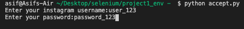
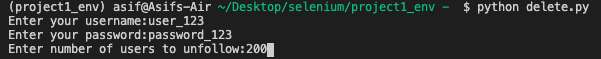
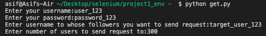

# Instagram Sciprts
## 1) accept.py 
This script will accept all pending following requests of the users account.

  

## 2) unfollow.py 
This script will unfollow n(entered by user) number of accounts of the user. 
Note: Instagram may not unfollow them all due to its maximum unfollow limit.

  

## 2) follow.py 
This script will send n(entered by user) number of follow requests to followers of a target account. 
Note: Instagram may not send request to them all because of its maximum following limit.

  

