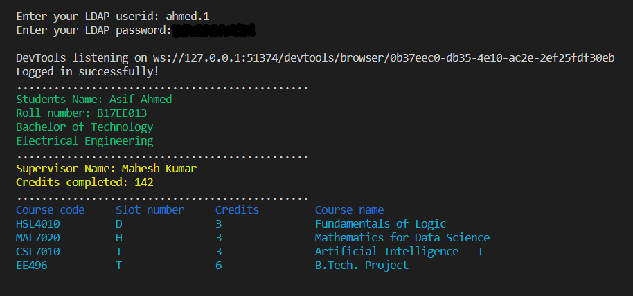

# Aryabhatta scripts
## 1)fetchInfo.py
This script will fetch the students academic information from the college's website. 
Note: Make sure that your system is connected to college's vpn before running the script.

  

